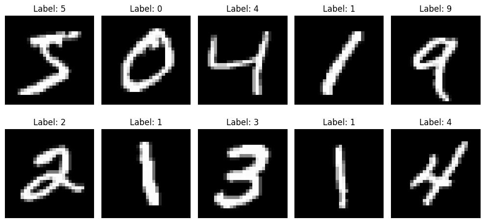
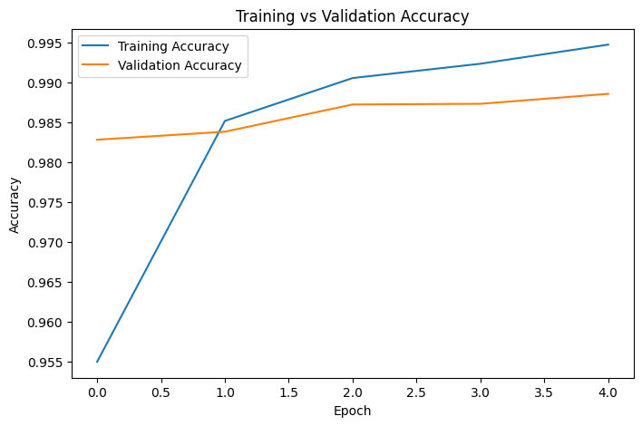
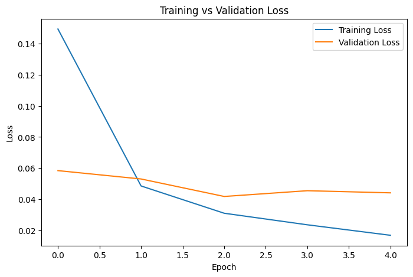
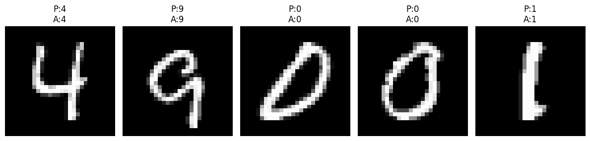

# 🔢 Digit Vision — CNN Handwritten Digit Classifier

A Convolutional Neural Network built with **TensorFlow/Keras** that recognizes handwritten digits (0–9) from the classic **MNIST** dataset with high accuracy.



## 📌 Overview

This project trains a CNN from scratch to classify 28×28 grayscale images of handwritten digits. It covers the full deep learning workflow — data loading, preprocessing, model building, training, evaluation, and visualization of results.

## 🧠 Model Architecture

```
Input (28x28x1)
   ↓
Conv2D(32 filters, 3x3, ReLU) → MaxPooling2D(2x2)
   ↓
Conv2D(64 filters, 3x3, ReLU) → MaxPooling2D(2x2)
   ↓
Flatten
   ↓
Dense(128, ReLU)
   ↓
Dense(10, Softmax)
```

## 📊 Results

| Metric | Value |
|---|---|
| Training Epochs | 5 |
| Optimizer | Adam |
| Loss Function | Categorical Crossentropy |

**Training vs Validation Accuracy**



**Training vs Validation Loss**



**Sample Predictions**



## 🛠️ Tech Stack

- Python 3
- TensorFlow / Keras
- NumPy
- Matplotlib

## 🚀 Getting Started

### 1. Clone the repository
```bash
git clone https://github.com/<your-username>/digit-vision-cnn.git
cd digit-vision-cnn
```

### 2. Install dependencies
```bash
pip install -r requirements.txt
```

### 3. Run the notebook
```bash
jupyter notebook cnn.ipynb
```

The MNIST dataset is downloaded automatically via `tensorflow.keras.datasets.mnist` — no manual download needed.

## 📁 Project Structure

```
digit-vision-cnn/
├── cnn.ipynb              # Main notebook: data prep, model, training, evaluation
├── assets/                 # Result images used in this README
├── requirements.txt
└── README.md
```

## 💡 Future Improvements

- Add dropout / batch normalization to reduce overfitting
- Experiment with data augmentation
- Try deeper architectures (ResNet-style blocks)
- Deploy as a simple web app with a drawable canvas for live digit prediction

## 📄 License

This project is licensed under the MIT License.
